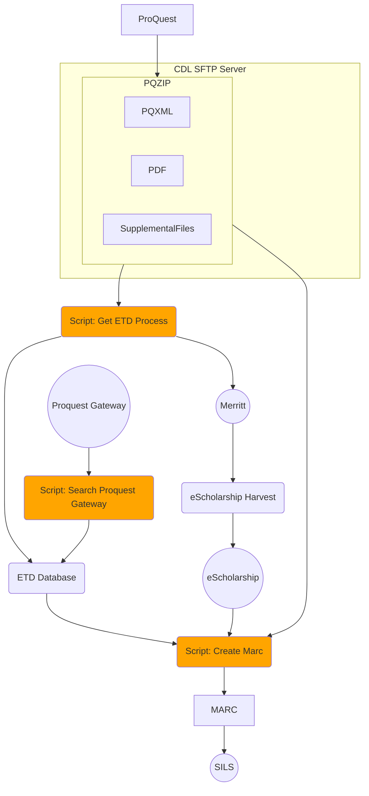
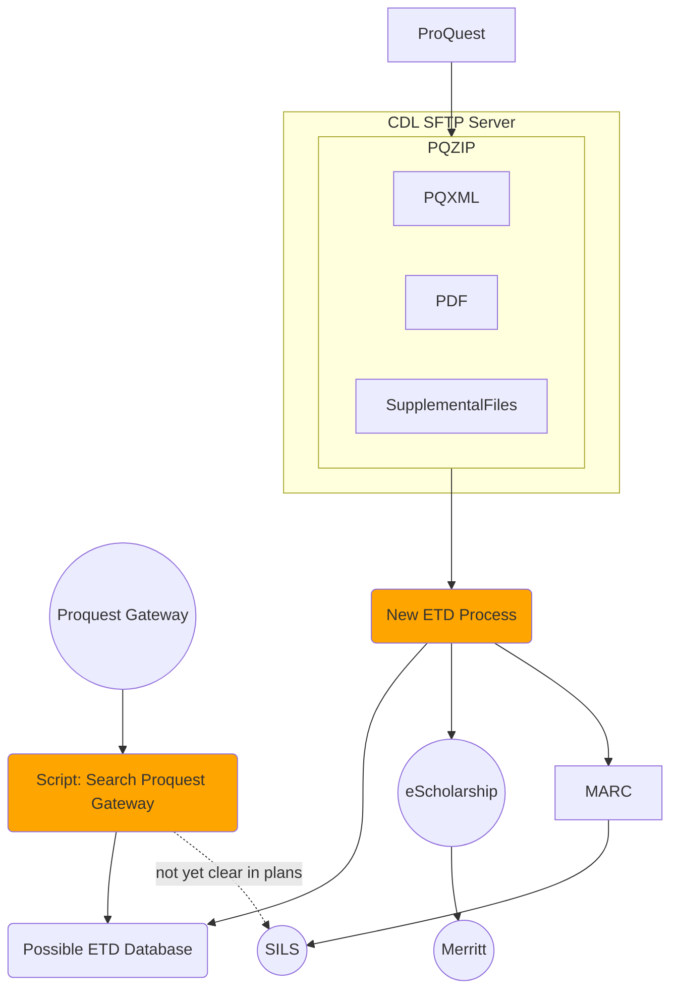

# ETD Workflow Diagram

## Current Process

```mermaid
graph TD
  ProQuest
  subgraph "CDL SFTP Server"
    subgraph PQZIP
      PQXML
      PDF
      SupplementalFiles
    end
  end

  Merritt((Merritt))
  ESCHOL((eScholarship))
  PQGATE((Proquest Gateway))
  SILS((SILS))

  ProQuest-->PQZIP
  ETD(Script: Get ETD Process)
  PQZIP-->ETD
  ETDDB(ETD Database)
  ETD-->ETDDB
  ETD-->Merritt
  ESHARV(eScholarship Harvest)
  Merritt-->ESHARV
  ESHARV-->ESCHOL
  pqg(Script: Search Proquest Gateway)
  PQGATE-->pqg
  pqg-->ETDDB
  createmarc(Script: Create Marc)
  ETDDB-->createmarc
  ESCHOL-->createmarc
  PQZIP-->createmarc
  createmarc-->MARC
  MARC-->SILS

  style ETD fill:orange
  style pqg fill:orange
  style createmarc fill:orange

```

## New Process

```mermaid
graph TD
  ProQuest
  subgraph "CDL SFTP Server"
    subgraph PQZIP
      PQXML
      PDF
      SupplementalFiles
    end
  end

  Merritt((Merritt))
  ESCHOL((eScholarship))
  PQGATE((Proquest Gateway))
  SILS((SILS))

  ProQuest-->PQZIP
  ETD(New ETD Process)
  PQZIP-->ETD
  ETDDB(Possible ETD Database)
  ETD-->ETDDB
  ETD-->ESCHOL
  ESCHOL-->Merritt
  ETD-->MARC
  Merritt((Merritt))
  MARC-->SILS

  PQGATE-->pqg
  pqg(Script: Search Proquest Gateway)
  pqg-->ETDDB
  pqg-.->|not yet clear in plans|SILS

  style ETD fill:orange
  style pqg fill:orange

```
